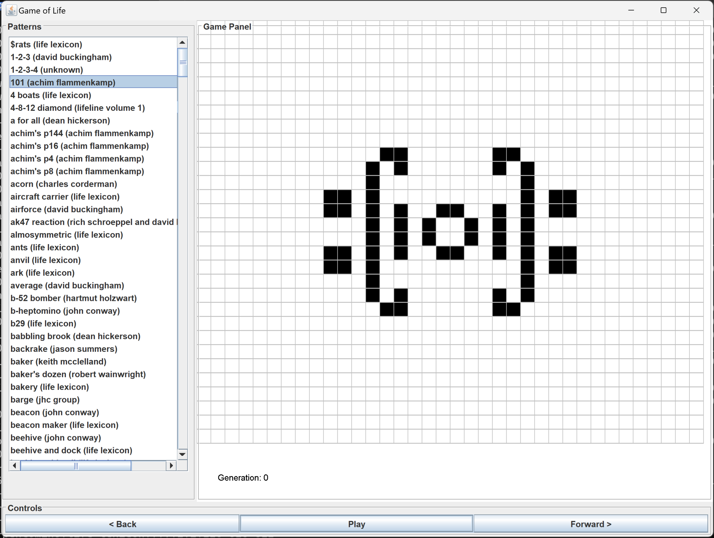

# Game-of-Life

My Part IA computer science project making the Game of Life using Java. Covered design patterns and multiple Java file programming. 

# How to Install
Compile all the Java files and then run the GUILife.class file

# File Description
A world is the sequence of patterns made from an inital pattern. The world file contains a pattern and the generation. 

- ArrayWorld stores and maintains the GameOfLife worlds as arrays
- PackedWorld stores and maintains the GameOfLife worlds as binary strings
- PatternFormatException and PatternNotFound and throwable exceptions for unacceptable patterns
- GUILife contains the main executable of the code
- World is the abstract parent class for all implementations of worlds

# License and Author info
Written by Me for my first year university project. 